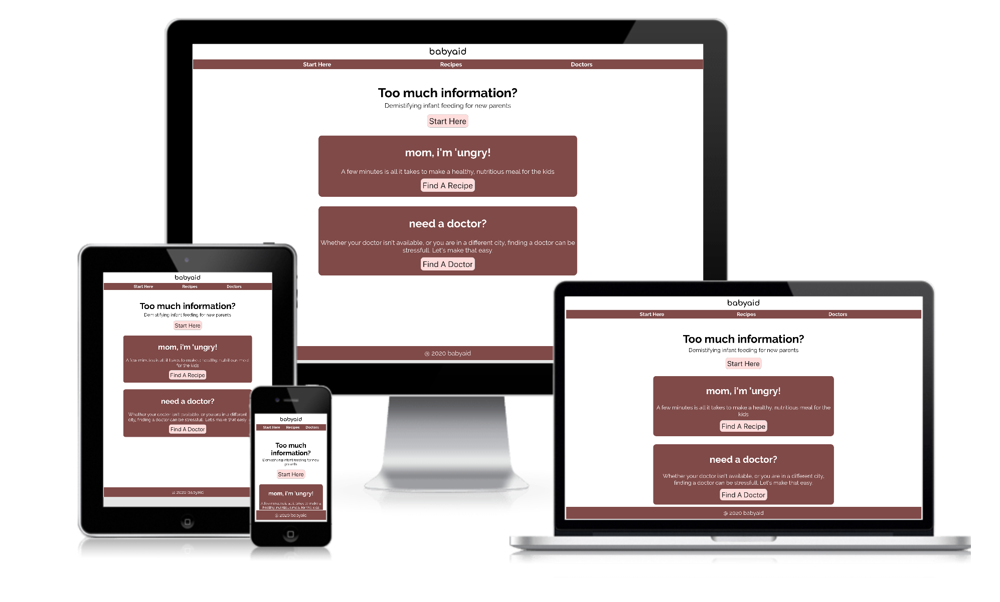
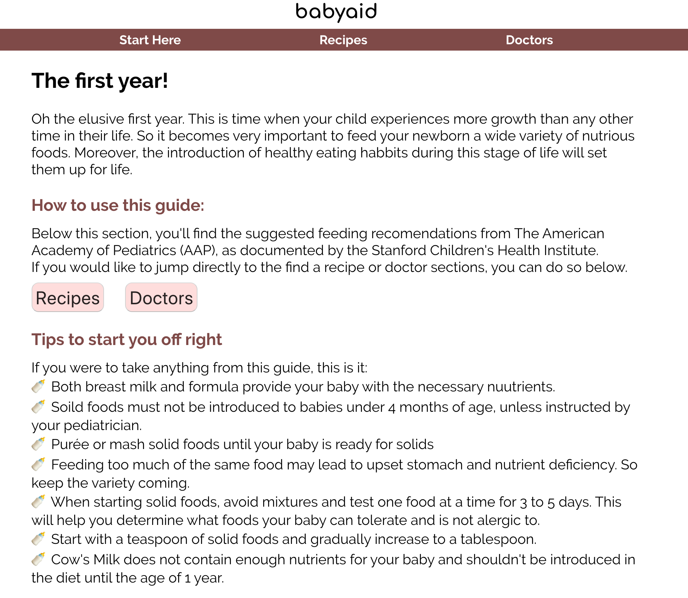
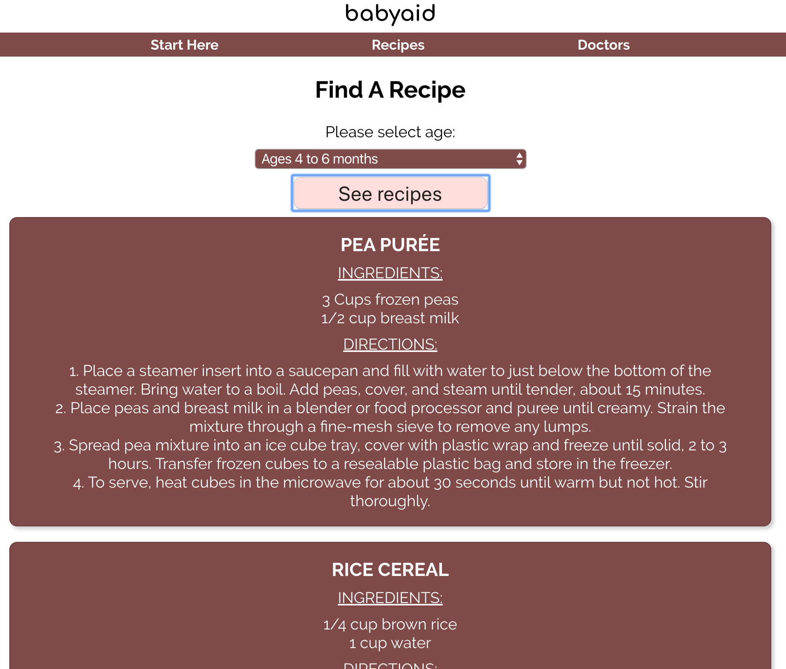
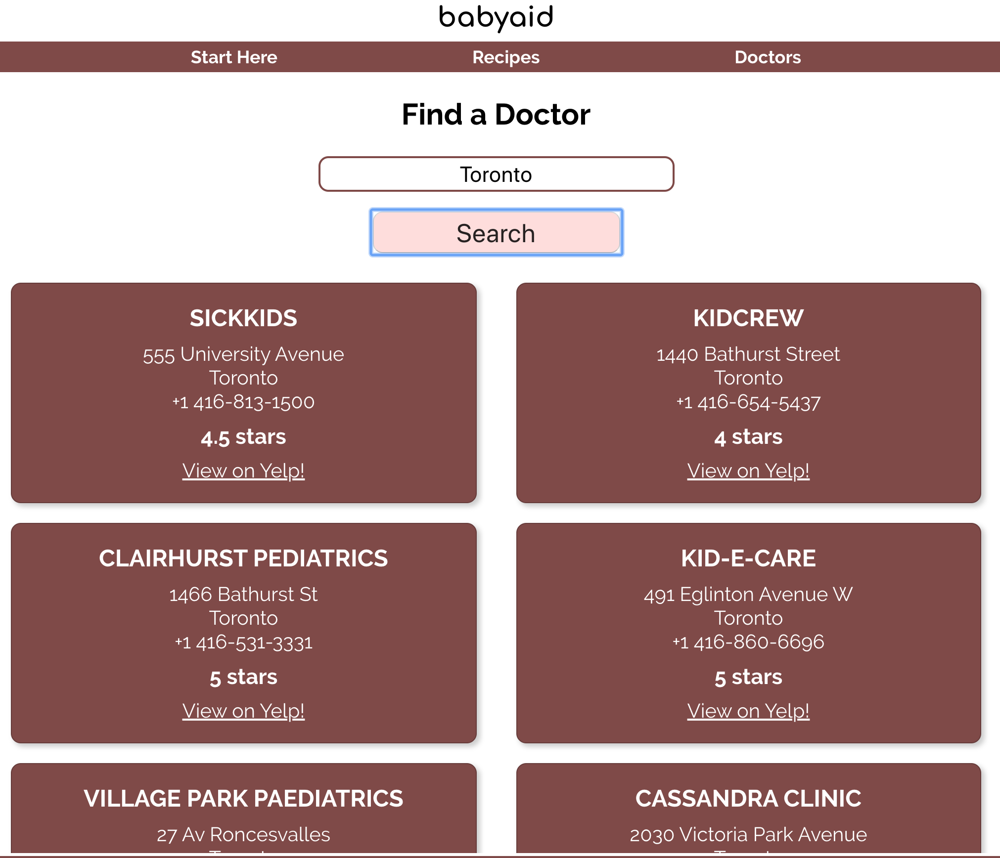

# babyaid

## Description
An app for new parents designed to guide them through the first year of their newborn's feeding schedule.
- "Start Here" page takes parents to a page that provides them with preliminary information on feeding, from ages Birth to Year 1.
- Using the "Recipes" page, parents can look up recipes based on the age of their child. There are 4 categories available, namely: 4 to 6 months, 6 to 8 months, 8 to 10 months and 10 to 12 months.
- "Doctors" page takes city name and pulls a list of pediatritions from Yelp using the Yelp Fusion API.

## Live page:
https://babyaid-client.now.sh/

## Techenical stack
### Front End built using
- React (create-react-app)
- React Router

### Back end built using
- Nodejs
- Express
- PostgreSQL
- Knex
- Postgrator
- Winston
- Morgan
- Helmet
- Dotenv

### External API
- Yelp Fusion

### API testing done using
- Chai
- Mocha
- Supertest

## Screenshots

## Github repos:
### Client:
https://github.com/gaganssingh/babyaid-client

### API:
https://github.com/gaganssingh/babyaid-api

## User Feedback:
First: https://gist.github.com/gaganssingh/56ba5e385084203a1ca68726a433b933
Second: https://gist.github.com/gaganssingh/a17e121042a4696b568d5cfeb5587312
